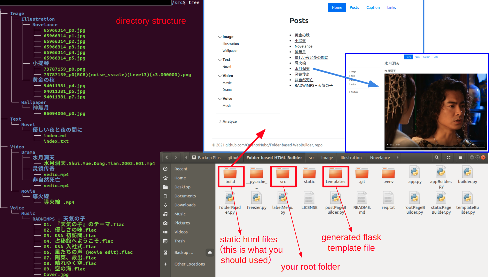

# Folder-based-HTML-Builder

  

------

This is a python project that `reads files in the root folder` to generate `static HTML files`. You can use it to build your web-based file manager, build simple and efficient log recording pages, and build simple content blog. The css/js has used is from [bootstrap](https://github.com/twbs/bootstrap).


## Requirement

```python
numpy==1.21.4
flask==2.0.2
pyyaml==6.0
Frozen-Flask==0.18
lorem==0.1.1
beautifulsoup4==4.10.0
```


## Usage

The root directory of the folder is defined as `./src`, run `builder.py` to generate Flask template files, and then run `freezer.py` to generate static HTML files. 



After that, the static files under `./build` can be placed in the upper-level directory of `src` . You can also deploy static web pages on your CDN.

In terms of the functions currently implemented, the third-level directory under the root directory is the title of each subpage.


## Notice

The code has not been sorted out (there are duplicate codes), and currently only the generation of web pages based on the secondary folder directory is realized.

